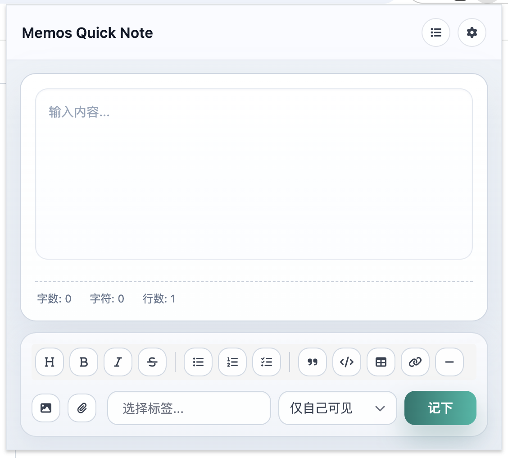
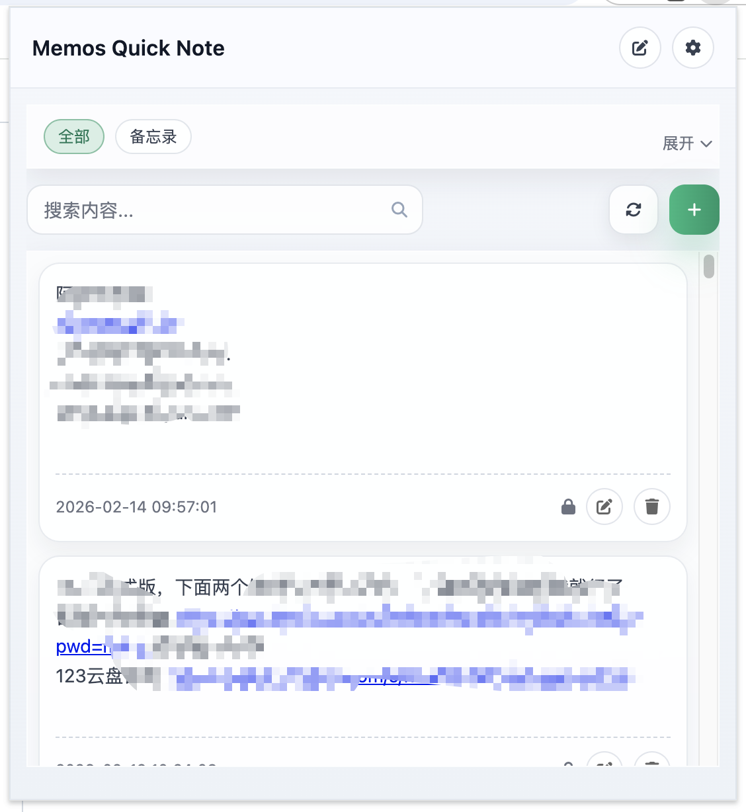
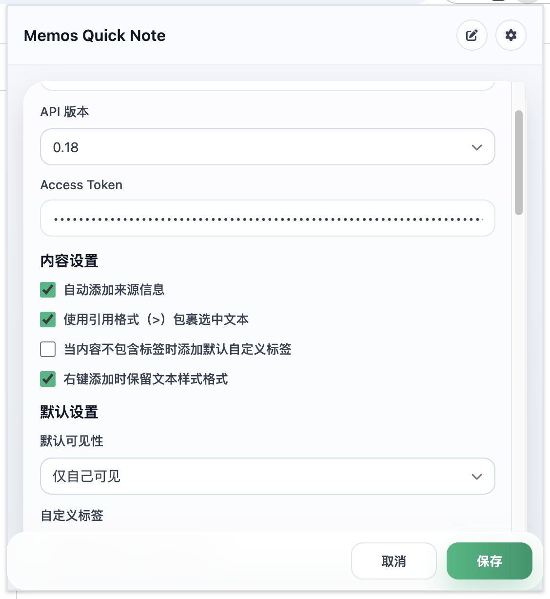

# Memos Quick Note

A browser extension for quickly adding notes to Memos. This extension allows you to capture ideas, save web content, and manage your knowledge with Memos.

[中文文档](README.md)

> Supports `Edge` / `Chrome` / `Firefox` / `Safari` / `Web`
>
> - `Edge`: install from [Microsoft Edge Add-ons](https://microsoftedge.microsoft.com/addons/detail/memos/ldhakmjejmcfahjbjcbfnnagmkkakgdd)
> - `Chrome` / `Firefox` / `Safari`: install offline from local build output
> - `Web`: build `dist/web` and deploy it to your own server

## v1.2.8 Updates

- Redesigned the editor, list, and settings pages with clearer visual hierarchy.
- Fixed the issue where bottom content in the editor could be clipped by a fixed height.
- The extension now remembers the last opened page and lets you choose remembered page / editor / list as the default view.
- Added a follow-system theme option and made it the default theme behavior.
- Changed the default API version to `0.18`.
- Simplified the settings page by removing the "preferred tags" setting.
- Fixed dropdown layering issues in Settings and completed local icon asset loading.
- Updated the contact email to `admin@aiti.xin`.
- Added Chrome / Firefox production build support.
- Added Safari temporary local testing build support on macOS via `dist/safari`.

## Overview

Memos Quick Note is a smart note-taking companion for Memos. It supports Memos `v0.18` / `v0.24` / `v0.25` / `v0.26`, with quick capture, tag completion, file and image upload, customizable shortcuts, and flexible settings for a smoother note workflow.

## Features

### Editing & Capture

- Quick memo creation
- Rich text and Markdown editing
- Toolbar for Markdown formatting
- Capture selected text from webpages
- Shortcut support

### Tags & Attachments

- Tag management with auto-completion
- File and image upload
- Drag-and-drop upload
- Paste upload support for images and files
- Image preview and file removal

### List & Browsing

- List view for managing memos
- Tag filtering
- Existing memo editing
- Ordered browsing by time

### Settings & UI

- Settings panel for customization
- Dark / Light / System theme support
- Multi-language support
- Adjustable layout and dimensions

### Compatibility & Delivery

- Supports Memos `v0.18` / `v0.24` / `v0.25` / `v0.26`
- Production builds for Chrome / Edge, Firefox, Safari, and Web

## Usage

1. Click the extension icon in your Edge toolbar
2. Start typing your note in the editor
3. Use the toolbar for Markdown formatting
4. Add tags with # symbol
5. Upload files or images using the upload buttons
6. Click "Save" to create your memo

## Settings

The extension provides various settings to customize your experience:

### Basic

- Host URL and API token configuration

### Content

- Source information and quote format options

### Defaults

- Default visibility and custom tags

### Shortcuts

- Customizable keyboard shortcuts

### Tags

- Tag input behavior and filter style

### Page

- Default view and dimensions

### Other

- Word count, theme, and language options

## Screenshots

### Editor



### List



### Settings



## Development

```bash
# Install dependencies
npm install

# Start development server
npm run dev

# Build all browser targets
npm run build

# Build a single target
npm run build:chrome
npm run build:firefox
npm run build:safari
npm run build:web

# Verify build output
npm run verify:build
```

## Installation / Testing

### Chrome / Edge

1. Run `npm run build:chrome`
2. Open the browser extensions page
3. Enable Developer Mode
4. Click "Load unpacked"
5. Select `dist/chrome`

### Firefox

1. Run `npm run build:firefox`
2. Open the Firefox debugging page for extensions
3. Temporarily load an add-on
4. Select `dist/firefox/manifest.json`

### Safari

1. Run `npm run build:safari`
2. Open Safari on macOS
3. Enable Safari development-related options
4. Temporarily install the extension folder
5. Select `dist/safari`

### Web

1. Run `npm run build:web`
2. Upload the files in `dist/web` to your static hosting directory
3. Open the deployed URL in your browser
4. On first launch, fill in your Memos Host and Token in Settings

## Web Version

### Included in the Web build

- Manual memo input
- Tag selection and auto-completion
- File / image upload
- Settings persistence
- Memo list viewing and editing
- Theme, language, and layout settings

### Not included in the Web build

- Right-click selected text injection from webpages
- Background-script-driven extension interactions
- Content script injection
- Extension popup entry behavior

### Web Deployment Notes

- If your web app and Memos service are on different domains, make sure your server allows CORS
- HTTPS is recommended to avoid browser restrictions around upload, authentication, or cross-origin requests

## Contributing

Contributions are welcome! Please feel free to submit a Pull Request.

## License

This project is licensed under the MIT License - see the [LICENSE](LICENSE) file for details.

## Acknowledgements

- Thanks to GitHub user `tianshubenshu` for contributing support for Memos `0.26`.

## Contact

- Email: admin@aiti.xin
